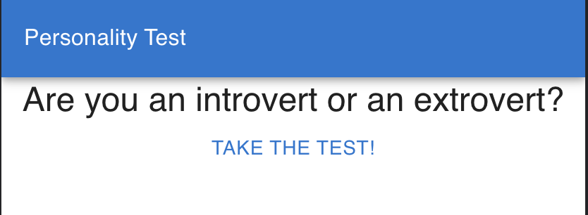
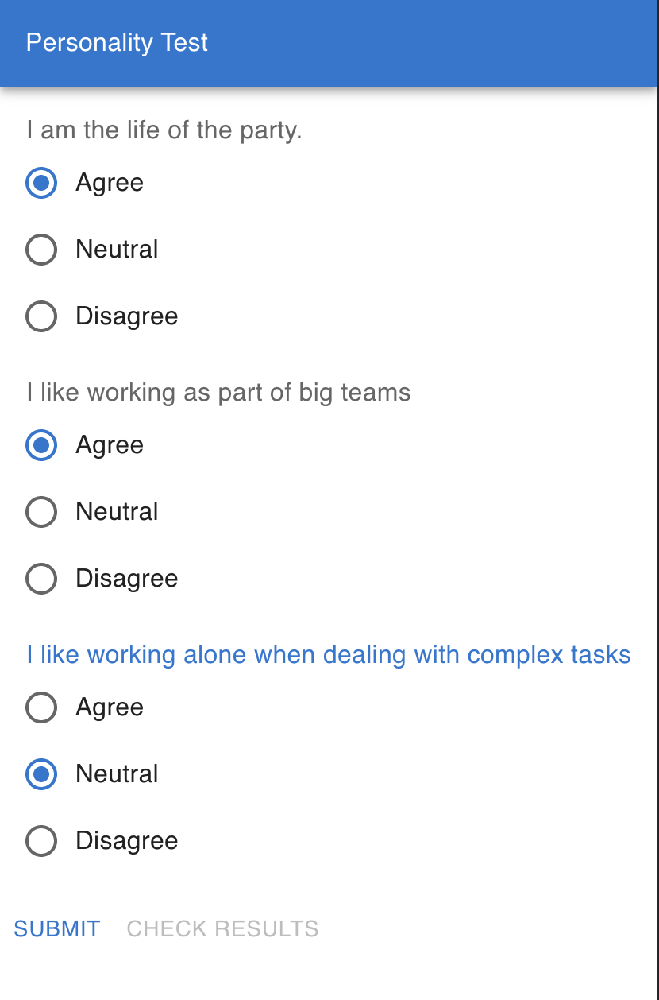
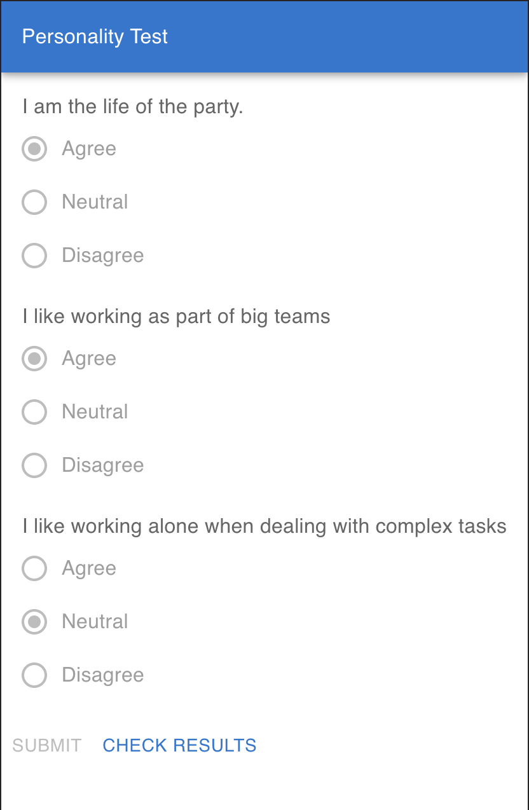
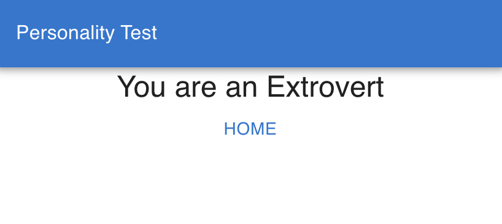

# Personality-test full-stack application

A simple personality test application, that takes 3-5 different questions, maps them into a score and produces a
personality trait of either Introvert or Extrovert.

It consists of:

## Landing screen

## Dynamic screen, that reads question and answers from the backend

#### Active Test

#### Completed Test

## Finish screen, where you can see your personality trait

